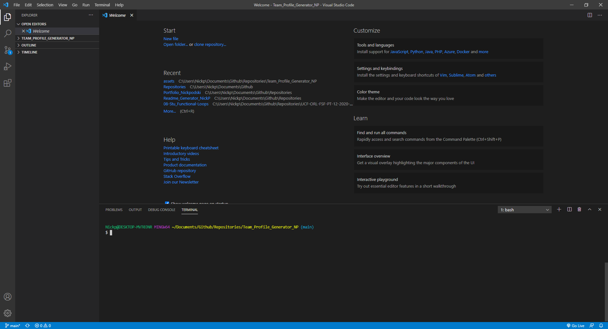
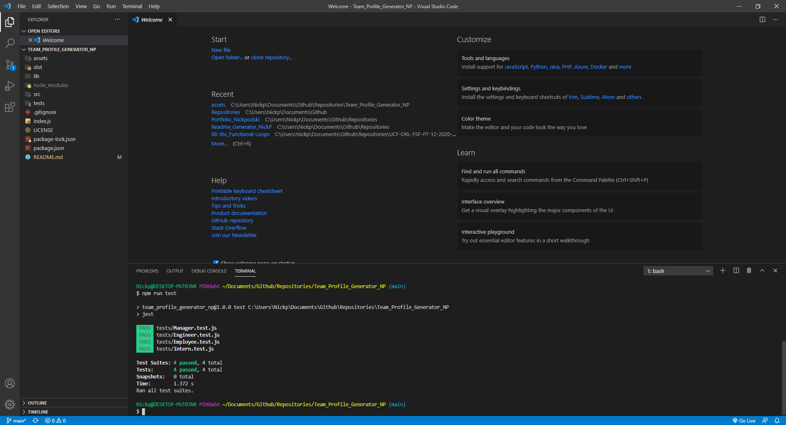
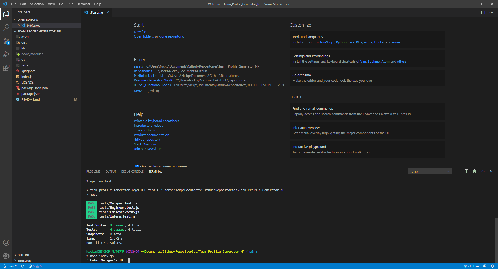
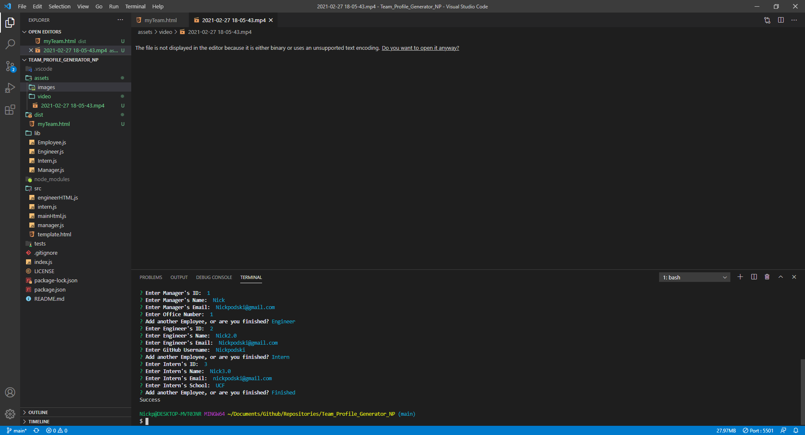
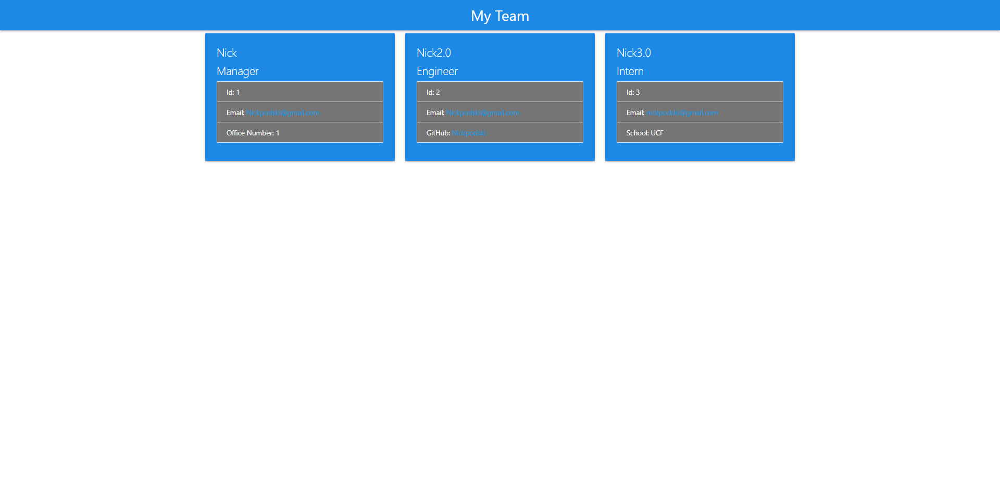

# Team_Profile_Generator_NP

## Description 

This program is to generate a team profile page. It will ask you questions about employee's then generate an HTML file for you to use.

## Table of Contents

  * [Installation](#installation)
  * [Usage](#usage)
  * [License](#license)
  * [Contributing](#contributing)
  * [Tests](#tests)
  * [Questions](#questions)

## Installation

  You must have node installed, but once you navigate into the project folder run npm install within the folder. It will install everything you need.

## Usage

  While in terminal/bash within the folder you can start the program with "node index.js". It will ask you some questions then based on your answers generate your html file within the "./dist/" folder.

  
  
  
  
  

  

## License

  THIS SOFTWARE IS PROVIDED BY THE COPYRIGHT HOLDERS AND CONTRIBUTORS "AS IS" AND ANY EXPRESS OR IMPLIED WARRANTIES, INCLUDING, BUT NOT LIMITED TO, THE IMPLIED WARRANTIES OF MERCHANTABILITY AND FITNESS FOR A PARTICULAR PURPOSE ARE DISCLAIMED. IN NO EVENT SHALL THE COPYRIGHT HOLDER OR CONTRIBUTORS BE LIABLE FOR ANY DIRECT, INDIRECT, INCIDENTAL, SPECIAL, EXEMPLARY, OR CONSEQUENTIAL DAMAGES (INCLUDING, BUT NOT LIMITED TO, PROCUREMENT OF SUBSTITUTE GOODS OR SERVICES; LOSS OF USE, DATA, OR PROFITS; OR BUSINESS INTERRUPTION) HOWEVER CAUSED AND ON ANY THEORY OF LIABILITY, WHETHER IN CONTRACT, STRICT LIABILITY, OR TORT (INCLUDING NEGLIGENCE OR OTHERWISE) ARISING IN ANY WAY OUT OF THE USE OF THIS SOFTWARE, EVEN IF ADVISED OF THE POSSIBILITY OF SUCH DAMAGE.
  https://opensource.org/licenses/BSD-3-Clause

## Contributing

## Tests

  JEST

## Questions

  How to reach me?
  GitHub: https://github.com/Nickpodski
  Email: Nickpodski@gmail.com

## Links

https://github.com/Nickpodski/Team_Profile_Generator_NP - Github Repo!
https://drive.google.com/file/d/1U4DaiBSRBxdDZzfZwZiEjxDEJCtEIJsh/view?usp=sharing - Demo Video

  